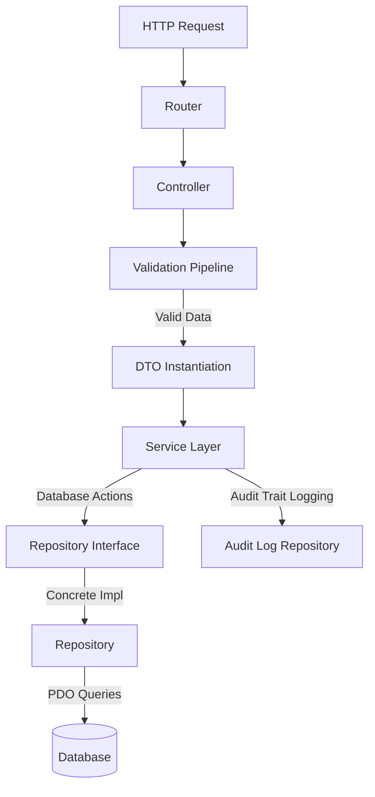

# Khadomeh Platform — Foundation Freeze Report (v0.3.0)

This report documents the architectural review, stabilization, and formal freezing of the Khadomeh platform core framework, administrative platform, database schema, and reference modules (Services and Locations).

---

## 1. Executive Summary
The Khadomeh framework has transitioned to **v0.3.0-foundation-frozen**. All foundational layers are officially locked down. Future feature expansions (such as Providers, Reviews, Settings, and Reports) must be built as pluggable modules adhering strictly to the patterns validated in this freeze. 

The core objectives achieved in this freeze include:
- **Zero Core Alteration Rule**: The core engine, request dispatchers, security pipelines, and administrative layout templates are closed for modification.
- **Location Module Maturity**: The Cities and Areas modules have been fully implemented under the reference MVC contract.
- **Database Schema & Seeds Alignment**: Database schemas and seed data have been elevated to production grade, containing comprehensive coverage of Syrian governorates and neighborhoods.
- **View Consolidation**: Removed HTML and logic duplication by centralizing UI structures in shared components.
- **Enhanced Diagnostics**: Extended the `/health` endpoint to perform functional checks across the entire system.

---

## 2. Architecture & Design Patterns
The platform adheres to an immutable **Controller ➔ Validation ➔ DTO ➔ Service ➔ Repository** layer sequence:

### Decoupled Layer Rules
1. **Controller**: Parses incoming request parameters, triggers validation, maps requests to DTOs, calls the service layer, and handles redirects or view rendering. It has zero SQL statements or transaction logic.
2. **Validation**: Enforces strict typing, string lengths, unique slug checking, and input sanitization (including Arabic text normalization).
3. **DTO (Data Transfer Object)**: A typed, immutable model class carrying structured data across application layers.
4. **Service**: Encapsulates all business logic, transactions, state mutations, and triggers corresponding Audit logs.
5. **Repository Interface**: Establishes a strict contract for data access, isolating query patterns from the business logic.
6. **Repository**: Contains raw SQL statements and PDO bindings. It never makes controller assumptions or changes business states.

---

## 3. Database Schema Standardization
The schemas for all modules have been unified:
- **Cities**: Table `cities` includes UUID (`public_id`), Arabic names, English slugs, sort orders, active statuses, SEO metadata, and soft-delete support (`is_deleted`, `deleted_at`).
- **Areas**: Table `areas` belongs to exactly one city via `city_id` and includes scoped unique constraints `uq_area_city_slug` on `(city_id, slug)`.
- **Audit Logs**: Integrated across all modules to capture creation, modifications (storing deltas), soft deletion, and restorations.

---

## 4. UI Components & Standardized Views
Redundant pagination and empty-state HTML code blocks have been removed from views:
- **Shared Pagination (`views/components/pagination.php`)**: Dynamically computes record offsets, page lists, and builds query strings without hardcoding parameters.
- **Shared Empty State (`views/components/empty_state.php`)**: Renders responsive feedback grids with customizable action prompts, buttons, and icons.

---

## 5. Diagnostic Diagnostics (`/health`)
The `/health` diagnostic endpoint has been expanded to test the functional health of all modules:
1. **Core Module**: Verifies class loading of routers, databases, configurations, and core session managers.
2. **Admin Platform**: Checks administrative database counts and checks accessibility.
3. **Services Module**: Confirms all Services classes exist and queries the services table.
4. **Cities Module**: Confirms all Locations/Cities classes exist and queries the cities table.
5. **Areas Module**: Confirms all Locations/Areas classes exist and queries the areas table.

---

## 6. Stability Verification
All regression scripts (`test_smoke.php`, `test_locations_crud.php`, `test_services_crud.php`) run successfully, reporting 100% test completion and database transaction safety.

The foundation is stable, documented, and frozen for production scaling.
