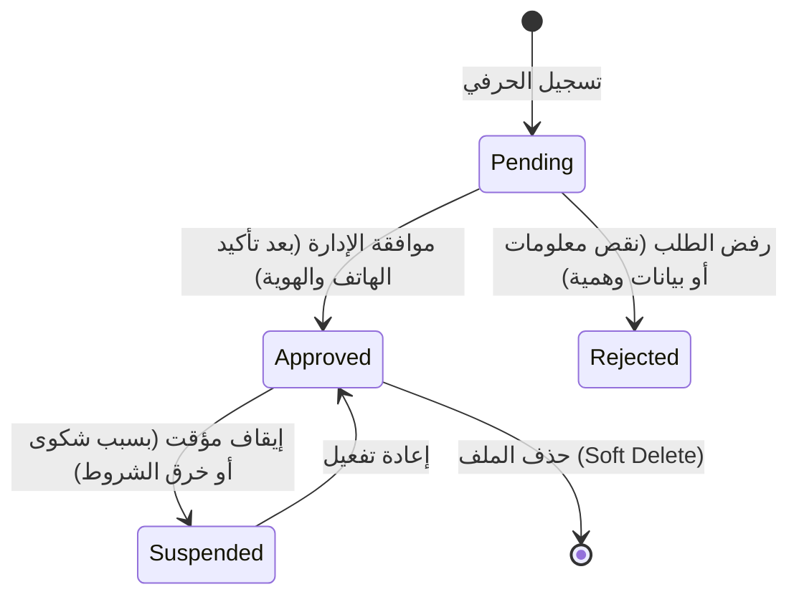

# خطة عمل وتطوير لوحة التحكم (Admin Control Plan)

يغطي هذا المستند المسار التقني والمخطط البرمجي لعمليات لوحة الإشراف (المرحلة القادمة)، والتي ستتيح للمدراء التحكم الكامل بكافة مدخلات المنصة وتفاصيل الحرفيين والتقييمات.

---

## 1. عمليات إضافة وتعديل الكائنات (General CRUD Operations)

تم تجهيز قاعدة البيانات لتدعم العمليات الإدارية الكاملة للمكونات الأساسية:

| الكائن (Entity) | عمليات الإضافة (Create) | عمليات القراءة (Read) | عمليات التحديث (Update) | عمليات الحذف (Delete) |
| :--- | :--- | :--- | :--- | :--- |
| **الحرفيون (`providers`)** | إضافة ملف حرفي جديد، تحديد الهاتف والواتساب، إعداد تفاصيل تسعيرته وخبرته. | تصفية الحرفيين حسب المحافظة، التخصص، أو حالة الطلب (مقبول، معلق). | تعديل أرقام الهواتف، رفع صور أعمال جديدة، كتابة ملاحظات إدارية داخلية. | الحذف الناعم (Soft Delete) عبر ملء عمود `deleted_at`. |
| **التقييمات (`reviews`)** | إضافة تقييم يدوي مستند لاتصال هاتفي مؤكد من الزائر. | عرض التقييمات المعلقة وتفاصيل هواتف المقيمين للتحقق. | الموافقة على التقييم ليظهر للعامة، أو رفضه وأرشفته. | حذف التقييمات العشوائية نهائياً. |
| **الشكاوى (`reports`)** | تلقي شكاوى الزوار وحفظها آلياً. | تصفية البلاغات المفتوحة وجدولة المتابعة مع أصحابها. | تعديل حالة الشكوى (`investigating` قيد التحقيق، `resolved` تم الحل). | أرشفة الشكاوى القديمة. |
| **الإعدادات العامة (`settings`)** | إضافة مفاتيح تكوين برمجية جديدة (مخصصة للمطورين). | قراءة إعدادات تواصل الموقع وعرضها داخل حقول الإدخال. | تعديل أرقام هواتف الموقع الرسمية، أو تفعيل "وضع الصيانة". | منع حذف الإعدادات الحساسة للنظام. |

---

## 2. إدارة وتعديل حالات الطلبات (State Transitions)

يمر ملف الحرفي والتقييمات بدورة حياة تعتمد على الحالات التالية في قاعدة البيانات:

### أ. ملف الحرفي (`providers.status`)


### ب. تقييمات العملاء (`reviews.status` & `reviews.is_approved`)
* **الحالة الافتراضية**: `pending` و `is_approved = 0`.
* **الموافقة**: تتغير الحالة إلى `approved` ويصبح حقل `is_approved = 1` ليظهر فوراً في ملف الحرفي العام وتتم إعادة حساب متوسط التقييم العام للحرفي (`providers.rating`).
* **الرفض**: تتغير الحالة إلى `rejected` ويبقى `is_approved = 0` وتتم أرشفته.

---

## 3. آليات ترتيب وعرض الحرفيين (Sorting & Display Algorithm)

لضمان عرض الحرفيين الموثوقين والمميزين في مقدمة نتائج البحث للزوار، تعتمد المنصة خوارزمية ترتيب ديناميكية تعتمد على الحقول التالية:
1. **الترقية والتمييز (`is_featured`)**: الحرفيون الحاصلون على وسم تميز تمنحه الإدارة يظهرون دائماً في الصفوف الأولى.
2. **وزن الترتيب المخصص (`sort_weight`)**: حقل رقمي يحدد يدوياً من لوحة التحكم لمنح أولوية إضافية لبعض الحرفيين النشطين.
3. **متوسط التقييم ورضا العملاء (`rating` & `reviews_count`)**: الحرفيون الحاصلون على تقييمات إيجابية أعلى وبعدد تقييمات أكبر يتقدمون تلقائياً في النتائج.

يتم كتابة استعلام الترتيب الافتراضي كالتالي:
```sql
SELECT * FROM `providers`
WHERE `is_active` = 1 AND `status` = 'approved' AND `deleted_at` IS NULL
ORDER BY `is_featured` DESC, `sort_weight` DESC, `rating` DESC, `id` DESC;
```
