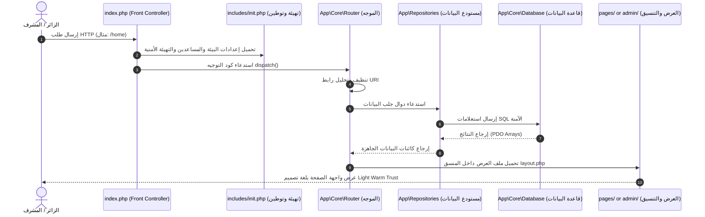

# توثيق البنية البرمجية والأنماط المعمارية (Architecture Documentation)

يعتمد مشروع **خدومة** على بنية برمجية مبسطة ونظيفة مكتوبة بلغة **Native PHP**، بهدف تقديم أقصى درجات الكفاءة والسرعة على الأجهزة الضعيفة وشبكات الإنترنت المحلية في سوريا.

---

## 1. الأنماط المعمارية المستخدمة (Design Patterns)

لضمان سهولة صيانة الكود وتطويره من قبل فرق العمل القادمة، يتبع المشروع الأنماط التالية:

* **نقطة الدخول الموحدة (Front Controller)**:
  تمر جميع الطلبات من خلال ملف `index.php` الرئيسي، والذي يتولى تشغيل ملفات التهيئة وتوجيه الطلبات إلى الصفحات المعنية.
* **نمط المستودعات لعزل البيانات (Repository Pattern)**:
  يتم عزل استعلامات قاعدة البيانات وعبارات SQL بالكامل داخل مجلد `app/Repositories/`. لا تحتوي ملفات الواجهات أو العرض على أي استعلام مباشر لقاعدة البيانات، بل تتواصل مع المستودعات المخصصة لكل جدول.
* **النمط الفردي للاتصال بقاعدة البيانات (Singleton Pattern)**:
  تتم إدارة كائن الاتصال بـ PDO عبر فئة `App\Core\Database` لضمان فتح اتصال واحد فقط بقاعدة البيانات طوال دورة حياة الطلب.
* **نظام التخطيط المشترك (Layout Pattern)**:
  يتم تنسيق الواجهات العامة عبر منسق تخطيط مركزي (`includes/layout.php`) يقوم بدمج الترويسة (`header.php`) ومحتوى الصفحة المطلوب وتذييل الصفحة (`footer.php`) تلقائياً.

---

## 2. دورة حياة الطلب (Request Lifecycle)

يوضح المخطط التالي كيفية معالجة طلب الزائر من لحظة كتابة الرابط وحتى عرض الصفحة:

---

## 3. حماية البيانات والأمان (Security by Design)

تم تصميم النظام ليكون آمناً ومحمياً من الثغرات البرمجية الشائعة تلقائياً:
1. **حقن الاستعلامات (SQL Injection)**: جميع الاستعلامات داخل المستودعات تستخدم الاستعلامات المجهزة (Prepared Statements) والمعاملات الممررة عبر PDO بشكل إجباري.
2. **ثغرة حقن النصوص البرمجية (XSS)**: يتم معالجة وعرض جميع النصوص الخارجية المخصصة للزوار باستخدام دالة الهروب المساعدة `e()` المعرفة في ملف الأمان البرمجي.
3. **ثغرة تزوير الطلبات العابرة للمواقع (CSRF)**: جميع نماذج الإرسال (Forms) - وفي مقدمتها نموذج تسجيل دخول المشرف - تحتوي على حقل تحقق مشفر `csrf_token` يتم توليده في الجلسة والتحقق منه قبل معالجة أي طلب POST.
4. **تأمين كوكيز الجلسات**: تم تهيئة الجلسات مع تفعيل خيارات `HttpOnly` لمنع قراءة الكوكيز عبر JS وتفعيل وسم `SameSite=Lax` للوقاية من تسريب الجلسات.
