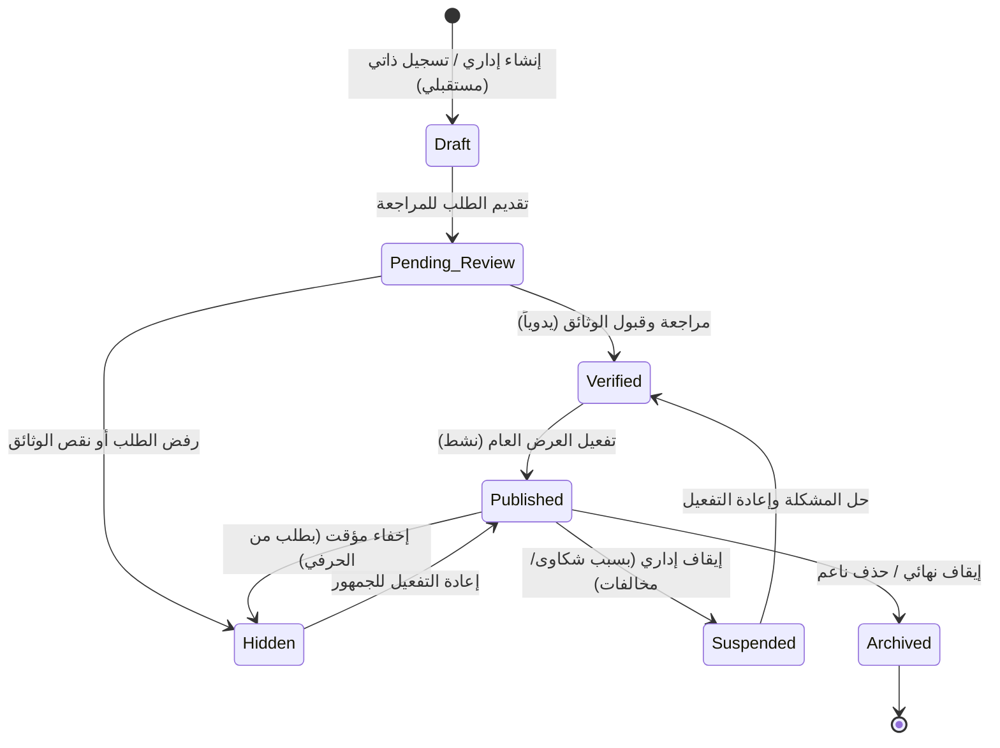
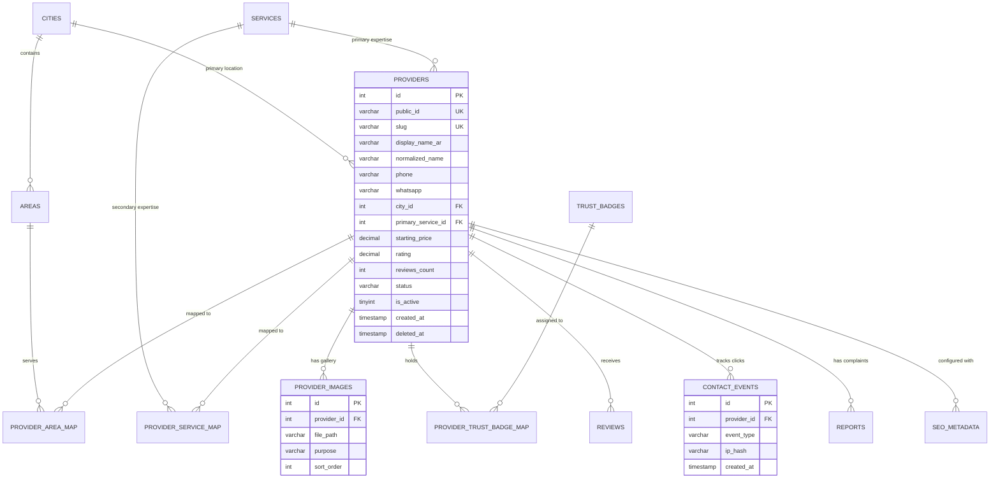
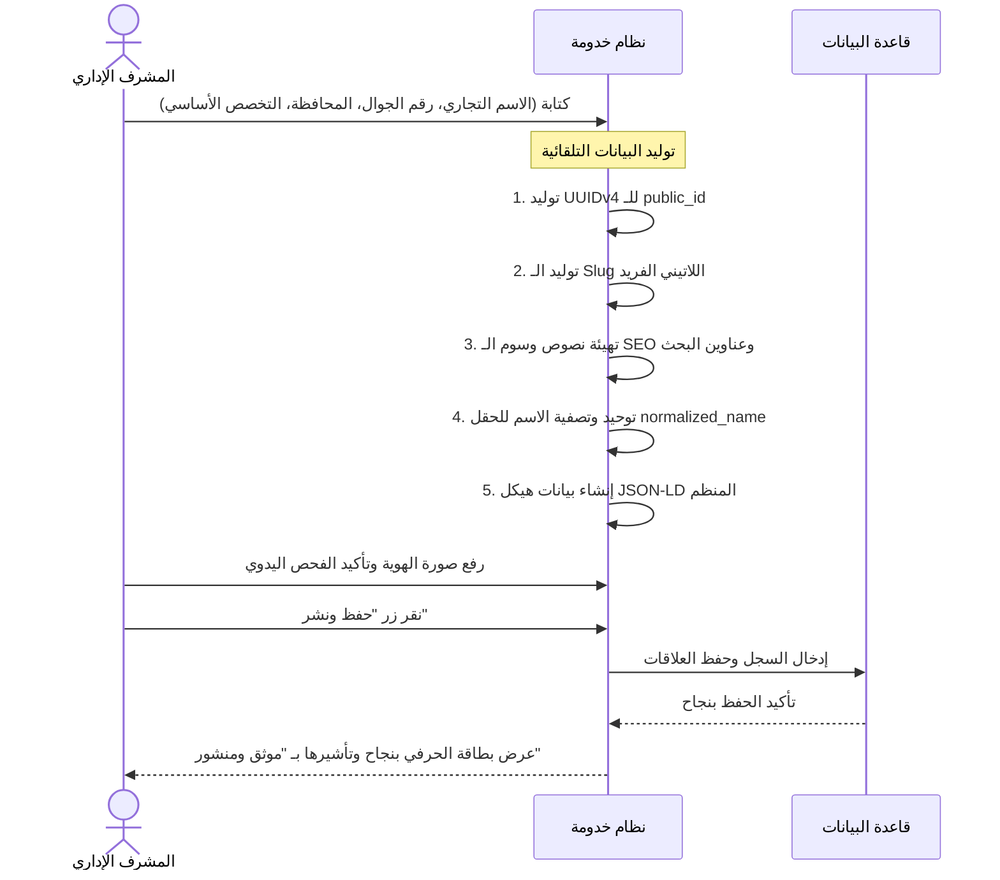

# وثيقة مواصفات نطاق الحرفيين (Provider Domain Specification)
## المرحلة الثالثة (Stage 3.0) — تصميم معماري فقط (Design Only)

تحدد هذه الوثيقة البنية المعمارية وتصميم البيانات لكيان **مزود الخدمة (الحرفي - Provider)** في منصة **خدومة (Khadomeh)**. يركز التصميم على تحقيق الهدف الأساسي للمنصة: **مساعدة العميل في العثور على حرفي موثوق به خلال أقل من 60 ثانية**، مع مراعاة بيئة الإنترنت المحلية في سوريا وتوافقها مع الأجهزة الضعيفة وخوادم الاستضافة المشتركة أو الـ VPS المحدودة.

---

## 1. دورة حياة الحرفي (Provider Lifecycle)

تتم إدارة حالة الحرفي عبر حالة النظام وحالة النشر لتوفير مرونة كاملة في الرقابة والأمن والتطوير المستقبلي.



### أ. وصف الحالات بالتفصيل:
* **Draft (مسودة)**: الحرفي تم إنشاؤه في لوحة التحكم ولكن لم تكتمل بياناته الأساسية بعد. لا يظهر للجمهور ولا يدخل في محرك البحث.
* **Pending Review (قيد المراجعة)**: الطلب مكتمل وينتظر تحقق الإدارة من رقم الهاتف وصحة البيانات المرفوعة.
* **Verified (موثق)**: تم التحقق من هوية الحرفي وأوراقه الثبوتية وصحة رقم هاتفه. الحرفي مؤهل للنشر الفوري.
* **Published (منشور/نشط)**: الحرفي معروض للجمهور في صفحات الموقع، ويظهر في نتائج البحث والخرائط/التصنيفات الجغرافية. أزرار الاتصال مفعلة.
* **Hidden (مخفي)**: الحرفي موثق ومكتمل ولكنه مخفي مؤقتاً عن الجمهور (مثال: بناءً على طلب الحرفي بسبب انشغاله أو إجازته، أو بقرار إداري لتحديث البيانات).
* **Suspended (موقوف مؤقتاً)**: تم تجميد حساب الحرفي بسبب بلاغات متكررة أو سلوك غير مهني. لا يظهر للجمهور ويمنع تحديث بياناته حتى مراجعة الإدارة.
* **Archived (مؤرشف)**: حذف ناعم للحساب (`deleted_at IS NOT NULL`). يتم الاحتفاظ بالبيانات لأغراض إحصائية وتدقيق العمليات التاريخية، لكن الحساب مغلق نهائياً ولا يمكن استعادته إلا بإجراء إداري خاص.

### ب. قواعد الانتقال بين الحالات (State Transitions):
* **الانتقالات المسموحة (Allowed)**:
  * من `Draft` إلى `Pending Review` فقط.
  * من `Pending Review` إلى `Verified` أو `Hidden` (في حال الرفض مع الاحتفاظ بالبيانات).
  * من `Verified` إلى `Published` أو `Hidden`.
  * من `Published` إلى `Hidden` أو `Suspended` أو `Archived`.
  * من `Suspended` إلى `Verified` (بعد حل الشكاوى) أو `Archived`.
  * من `Hidden` إلى `Published` أو `Archived`.
* **الانتقالات الممنوعة (Forbidden)**:
  * يمنع الانتقال من `Draft` مباشرة إلى `Published` أو `Verified` دون المرور بـ `Pending Review`.
  * يمنع الانتقال من `Suspended` إلى `Published` مباشرة دون استعادة حالة `Verified` أولاً للتأكد من زوال سبب الإيقاف.
  * يمنع تعديل أي بيانات للحرفي عندما يكون في حالة `Archived` أو `Suspended`.

### ج. التوافقية المستقبلية للتسجيل الذاتي (Self-Service Compatibility):
* عند فتح التسجيل الذاتي للحرفيين مستقبلاً، يتم إنشاء حساب الحرفي افتراضياً بحالة `Draft`. بمجرد إكمال الحرفي لملفه الشخصي ورفع وثائقه، يتحول الحساب تلقائياً إلى `Pending Review` ويرسل إشعاراً للإدارة للمراجعة، مما يمنع ظهور أي حرفي غير موثوق به على الموقع تلقائياً.

---

## 2. نموذج بيانات الحرفي (Provider Model Design)

تم تقسيم حقول الكيان لضمان كفاءة التخزين والسرعة الفائقة في الاستعلامات وتجنب تكرار البيانات.

### أ. تصنيف الحقول وتوصيفها:

#### 1. الحقول المطلوبة (Required Fields):
* `id` (`INT AUTO_INCREMENT PRIMARY KEY`): المعرف الرقمي الداخلي لقاعدة البيانات.
* `public_id` (`VARCHAR(36) UNIQUE`): معرّف UUIDv4 مستقر يُعرض للجمهور في الروابط لعدم كشف معرفات قاعدة البيانات الرقمية وحماية النظام من محاولات التخمين الكثيف.
* `slug` (`VARCHAR(150) UNIQUE`): الرابط النصي المحسن للحرفي (SEO Friendly).
* `display_name_ar` (`VARCHAR(200)`): الاسم التجاري أو الشخصي الظاهر باللغة العربية (مثال: "الكهربائي أبو أحمد").
* `normalized_name` (`VARCHAR(200)`): الاسم منزوع التشكيل والهمزات لتسريع الفهرسة والتطابق النصي (مثال: "الكهربائى ابو احمد").
* `business_type` (`ENUM('individual', 'company')`): نوع العمل لتحديد طبيعة تقديم الخدمة.
* `phone` (`VARCHAR(30)`): رقم الهاتف الجوال الأساسي للتواصل المباشر.
* `city_id` (`INT FOREIGN KEY`): معرف المحافظة الأساسية التي يقيم فيها أو يتبع لها إدارياً.
* `primary_service_id` (`INT FOREIGN KEY`): التخصص أو الخدمة الأساسية التي يبرع فيها الحرفي (مثال: سباكة).
* `status` (`VARCHAR(30) DEFAULT 'draft'`): حالة دورة حياة الحرفي.
* `is_active` (`TINYINT(1) DEFAULT 0`): مؤشر التحكم بالعرض العام (0 = مخفي، 1 = معروض).

#### 2. الحقول الاختيارية (Optional Fields):
* `bio` (`TEXT`): نبذة تعريفية قصيرة يكتبها الحرفي أو المشرف عن خبراته وأعماله (حد أقصى 500 حرف).
* `whatsapp` (`VARCHAR(30)`): رقم الواتساب للتواصل النصي (إن وجد).
* `starting_price` (`DECIMAL(10,2) DEFAULT NULL`): السعر المبدئي التقريبي بالليرة السورية لفتح العداد أو المعاينة.
* `avatar_url` (`VARCHAR(255) DEFAULT NULL`): رابط الصورة الشخصية أو شعار الشركة.
* `cover_url` (`VARCHAR(255) DEFAULT NULL`): رابط غلاف صفحة الحرفي.
* `average_rating` (`DECIMAL(3,2) DEFAULT 0.00`): متوسط التقييم الحالي (محتسب تلقائياً من جداول التقييمات).
* `reviews_count` (`INT DEFAULT 0`): إجمالي عدد التقييمات المقبولة للحرفي.
* `sort_weight` (`INT DEFAULT 0`): وزن إضافي للتحكم بترتيب الظهور إدارياً (لأغراض التميز البرونزي/الفضي/الذهبي مستقبلاً).

#### 3. الحقول المحتسبة ديناميكياً (Derived Fields):
* `is_published` (`Boolean`): يُحتسب من خلال التحقق من `status == 'verified' AND is_active == 1 AND deleted_at IS NULL`.
* `whatsapp_link` (`String`): رابط مجهز لفتح محادثة واتساب مباشرة بصيغة: `https://wa.me/963xxxxxxxxx?text=...`.
* `experience_years` (`Int`): يُستنتج من تاريخ التأسيس/ممارسة المهنة المدخل.

#### 4. الحقول الخاصة (Private Fields - للإدارة فقط):
* `national_id_proof` (`VARCHAR(255)`): مسار صورة الهوية الشخصية السورية للحرفي المرفوعة بشكل آمن في مجلد مغلق.
* `certificate_proofs` (`TEXT`): مصفوفة JSON لمسارات ملفات شهادات الخبرة أو رخص النقابة.
* `admin_notes` (`TEXT`): ملاحظات داخلية يكتبها مدراء النظام حول سلوك الحرفي أو تفاصيل التحقق منه.
* `last_verified_at` (`TIMESTAMP`): تاريخ آخر عملية توثيق للملف الشخصي.

#### 5. الحقول العامة (Public Fields):
* تشمل الاسم، التخصص، المدينة، الأحياء المغطاة، متوسط التقييم، الصور العامة للورش، وأرقام الاتصال (فقط في حال كان الحساب منشوراً).

#### 6. حقول الـ SEO (SEO Fields):
* `seo_title` (`VARCHAR(150)`): العنوان المخصص لصفحة الحرفي لمحركات البحث (إن وجد، وإلا يتم توليده تلقائياً).
* `seo_description` (`VARCHAR(255)`): الوصف المخصص لصفحة الحرفي (إن وجد، وإلا يتم توليده تلقائياً).

#### 7. حقول الترتيب (Ranking Fields):
* `freshness_score` (`DECIMAL`): نقاط تُمنح للحرفي بناءً على آخر تحديث للملف أو آخر نشاط له لضمان حيوية الترتيب.
* `activity_index` (`INT`): عدد النقرات التراكمية على الاتصال/واتساب خلال آخر 30 يوماً.

#### 8. الحقول المستقبلية المحجوزة (Future Fields):
* `premium_level` (`VARCHAR(20)`): مستوى الحساب المتميز (`free`, `silver`, `gold`).
* `featured_until` (`TIMESTAMP`): تاريخ انتهاء صلاحية إبراز الحرفي في مقدمة النتائج.
* `parent_id` (`INT NULL`): معرف الحرفي الأب (لدعم الفروع المتعددة للشركات الكبرى).

### ب. حقول تم رفضها مع التبرير (Rejected Fields):
1. **الإحداثيات الجغرافية الدقيقة (Latitude / Longitude)**:
   * *سبب الرفض*: غالبية الحرفيين في سوريا يتنقلون للعمل في منازل الزبائن ولا يملكون ورشات ثابتة تحتاج لإحداثيات دقيقة. الاعتماد على تحديد المحافظة والأحياء (`areas`) كافٍ جداً لتصفية نتائج البحث الجغرافي ويوفر حماية أمنية لخصوصية الحرفيين ويسهل التخزين والتحميل.
2. **وسائل التواصل الاجتماعي الشخصية (Facebook/Instagram/LinkedIn links)**:
   * *سبب الرفض*: زيادة حقول غير ضرورية تشتت الزائر عن الهدف الأساسي (الاتصال المباشر خلال 60 ثانية). كما تساهم في إخراج الزائر من المنصة وتخفيض معدل التحويل (Conversion Rate).
3. **تفاصيل التسعير المعقدة (جداول أسعار المواد والخدمات بالتفصيل)**:
   * *سبب الرفض*: بسبب التضخم الاقتصادي السريع وتغير الأسعار المستمر في سوريا، يصعب على الحرفي أو الإدارة تحديث جداول تفصيلية يومياً. الاكتفاء بحقل السعر المبدئي أو سعر المعاينة (`starting_price`) يمنع المعلومات المضللة ويوجه العميل للاستفسار الهاتفي المباشر.

---

## 3. العلاقات وهيكل قاعدة البيانات (Relationships & Schema)

يرتبط كيان الحرفي بشكل محوري ببقية جداول النظام لتمثيل البيانات الجغرافية والخدمية بشكل دقيق وصالح للتوسع.



### العلاقات بالتفصيل:
1. **مع المدن (`cities`)**: علاقة (كثير إلى واحد) تحدد المحافظة الرئيسية للحرفي.
2. **مع الأحياء (`areas`)**: علاقة (متعدد لمتعدد) عبر جدول وسيط `provider_area_map` لتحديد الأحياء التي يغطيها الحرفي ضمن المحافظة.
3. **مع الخدمات (`services`)**:
   * *الخدمة الرئيسية*: علاقة (كثير إلى واحد) تحدد التخصص الأساسي الذي يظهر بجانب اسم الحرفي.
   * *الخدمات الثانوية*: علاقة (متعدد لمتعدد) عبر جدول وسيط `provider_service_map` لتحديد المهارات الفرعية الإضافية.
4. **مع معرض الصور (`provider_images`)**: علاقة (واحد لمتعدد) تخزن مسارات الصور الشخصية، الأوراق الثبوتية، وصور معرض الأعمال.
5. **مع شارات التوثيق (`trust_badges`)**: علاقة (متعدد لمتعدد) عبر جدول وسيط `provider_trust_badge_map` لتحديد الشارات الممنوحة إدارياً (هوية موثقة، رقم هاتف مؤكد، رخصة نقابية).
6. **مع نقرات الاتصال (`contact_events`)**: علاقة (واحد لمتعدد) لتسجيل كل نقرة يقوم بها الزوار لطلب رقم الحرفي أو إرسال محادثة واتساب له.
7. **مع التقييمات (`reviews`)**: علاقة (واحد لمتعدد) تخزن تقييمات العملاء المقبولة والرافضة وحالتها الإشرافية.

---

## 4. فلسفة الملف الشخصي للحرفي (Provider Profile Philosophy)

يرتكز تصميم صفحة الملف الشخصي للحرفي في منصة "خدومة" على إجابة خمسة أسئلة جوهرية خلال ثوانٍ معدودة، مبسطة لتعمل على متصفحات الجوال البسيطة وسرعات الإنترنت المتدنية دون الحاجة لملفات جافا سكريبت ضخمة أو واجهات ثقيلة:

| السؤال | العنصر المسؤول في الواجهة | الهدف والوظيفة البصرية |
| :--- | :--- | :--- |
| **من هذا الحرفي؟ (Who)** | الاسم الظاهر + صورة الحساب + شارة نوع العمل (فرد/شركة) | تحديد هوية الحرفي بوضوح وبناء طابع إنساني ودود. |
| **ماذا يقدم؟ (What)** | التخصص الرئيسي والفرعي + صور معرض الأعمال السابقة | التحقق الفوري من أن مهارات الحرفي تتطابق مع حاجة العميل الفعلية. |
| **أين يعمل؟ (Where)** | اسم المحافظة + قائمة الأحياء المشمولة بالتغطية | التأكد من أن الحرفي مستعد للقدوم لموقع العميل الجغرافي. |
| **لماذا أثق به؟ (Why Trust)** | شارة التوثيق الأخضر المانعة للتزوير + تقييم النجوم التراكمي + عدد المراجعات المعتمدة | تقديم برهان اجتماعي فوري يزيل تردد العميل ويشجع على الاتصال. |
| **كيف أتصل به؟ (How to Contact)** | زرين عريضين بلون مميز في أسفل الشاشة (اتصال هاتفي مباشر / محادثة واتساب) | تسهيل خطوة التحويل الأساسية بلمسة واحدة ومن دون أي تعقيد. |

### مبدأ "الثقة قبل البيانات، والاتصال قبل التعقيد":
لا يحتاج العميل في سوريا لتصفح سيرة ذاتية معقدة أو قراءة شروط دفع إلكتروني. العميل يريد التأكد من أمرين: **"هل هو قريب ومحترف؟"** ثم **"أعطني رقم هاتفه لأتفق معه"**. لذلك، تم اختزال كافة الميزات التفاعلية لصالح إبراز أزرار الاتصال وشارات التوثيق في الجزء العلوي من الصفحة (Above the Fold).

---

## 5. استراتيجية الروابط وعناوين URL (URL Strategy)

تم تصميم الروابط لتكون صديقة لمحركات البحث (SEO-friendly)، سهلة الحفظ، ومستقرة، مع دعم إعادة التوجيه التلقائي لمنع الروابط المكسورة.

### أ. هيكل الروابط القياسية (Canonical URLs):
* **صفحة الملف الشخصي للحرفي**:
  `/provider/{slug}`
  *مثال*: `https://khadomeh.com/provider/ahmad-plumber-mazzeh`
* **صفحات الهبوط للخدمات في المدن (محافظات)**:
  `/search/{service-slug}-in-{city-slug}`
  *مثال*: `https://khadomeh.com/search/plumber-in-damascus`
* **صفحات الهبوط للخدمات في الأحياء**:
  `/search/{service-slug}-in-{city-slug}/{area-slug}`
  *مثال*: `https://khadomeh.com/search/plumber-in-damascus/mazzeh`

### ب. قواعد توليد الروابط النصية (Slug Rules):
1. يتكون الـ Slug تلقائياً عند إنشاء الحرفي بدمج الاسم اللاتيني المعرب والخدمة والحي الرئيسي (مثال: `display_name_en` + `service_slug` + `area_slug`).
2. يجب أن يحتوي الـ Slug على حروف إنجليزية صغيرة وأرقام وعلامة الشرطة الوسطى `-` فقط. يمنع استخدام المسافات أو الرموز الخاصة أو الحروف العربية في الروابط لضمان سهولة نسخها ومشاركتها عبر تطبيقات التواصل (الروابط العربية تتحول إلى رموز مشفرة طويلة ومزعجة `%D8%A7%D9%84%D8%AE`).

### ج. استراتيجية تعديل الروابط وإعادة التوجيه (Redirect Strategy):
* في حال قام المشرف بتغيير اسم الحرفي أو تعديل الـ Slug الخاص به، يسجل النظام الـ Slug القديم في جدول توجيه مخصص (`url_redirects`) ويربطه بالـ Slug الجديد.
* عند محاولة زائر أو محرك بحث الدخول للرابط القديم، يتولى الموجه (Router) إرسال رمز استجابة **HTTP 301 Moved Permanently** للتوجيه الفوري للعنوان الجديد، مما يحمي أرشفة الموقع في جوجل ويمنع ظهور صفحات الخطأ 404.

---

## 6. استراتيجية البحث والترتيب (Search & Ranking Strategy)

تم تصميم محرك البحث ليعمل بكفاءة وسرعة على قاعدة بيانات MySQL دون الحاجة لمحركات بحث خارجية ثقيلة (مثل Elasticsearch)، ليتناسب مع البيئة التقنية المبسطة للـ VPS.

### أ. عوامل ومعايير الترتيب والتصنيف (Multi-Factor Ranking Formula):
يتم احتساب وزن ظهور الحرفي في نتائج البحث بناءً على معادلة تراكمية تضمن تصدر الأفضل والأوثق:

$$\text{Ranking Score} = (S \times 0.40) + (V \times 0.25) + (R \times 0.20) + (F \times 0.15)$$

حيث أن:
* **$S$ (مطابقة الخدمة والموقع - Service & Location Relevance)**: مطابقة تامة للتخصص والحي المطلوب (100 نقطة) أو مطابقة الخدمة مع حي مجاور ضمن نفس المحافظة (50 نقطة).
* **$V$ (حالة التوثيق - Verification Status)**: الحرفي الحاصل على شارة التوثيق يحصل تلقائياً على 100 نقطة إضافية لضمان تصدر الموثقين لحماية الزوار.
* **$R$ (جودة التقييمات - Rating Quality)**: متوسط التقييم الفعلي للنجوم مضروباً في لوغاريتم عدد التقييمات لتجنب تصدر حرفي بتقييم واحد 5 نجوم على حرفي آخر بتقييم 4.8 من 100 زبون.
* **$F$ (تحديث البيانات والنشاط - Freshness & Activity)**: الحرفيون الذين يقومون بتحديث ملفاتهم أو يتلقون اتصالات ناجحة مؤخراً يحصلون على نقاط إضافية لضمان عدم بقاء الملفات المهجورة في الصدارة.

### ب. معالجة وتدقيق النصوص العربية (Arabic Normalization):
لتجنب أخطاء الإملاء الشائعة لدى الزوار السوريين في محرك البحث، يتم تصفية وتوحيد الكلمات المدخلة في حقل `normalized_name` للحرفي والخدمات قبل البحث البرمجي:
* إزالة علامات التشكيل بالكامل (الفتحة، الضمة، الكسرة، التنوين).
* تحويل الهمزات بمختلف أشكالها (أ، إ، آ) إلى ألف عادية (ا).
* تحويل التاء المربوطة (ة) في نهاية الكلمات إلى هاء (ه).
* تحويل الياء المقصورة (ى) إلى ياء عادية (ي) أو العكس.
* إزالة أل التعريف من الكلمات عند البحث لتسهيل المطابقة (مثال: "السباك" تطابق "سباك").

### ج. مستويات المطابقة النصية:
1. **المطابقة التامة (Exact Match)**: البحث عن اسم الحرفي أو الخدمة كما هي بالضبط (الأولوية القصوى في الترتيب).
2. **المطابقة الجزئية (Partial Match)**: مطابقة جزء من الكلمات المدخلة باستخدام `LIKE 'keyword%'` مستفيدة من فهارس الاستعلام المسبقة.

---

## 7. أرشفة محركات البحث (SEO Strategy)

تعتبر كل صفحة حرفي في منصة خدومة صفحة هبوط مستقلة ومهيأة للظهور في الصفحة الأولى لجوجل عند البحث عن خدمات محلية في سوريا (مثال: "دهان ممتاز في جرمانا ريف دمشق").

### أ. وسوم البيانات الوصفية الديناميكية (Dynamic Meta Tags):
* **Meta Title (عنوان الصفحة)**: يتم صياغته بشكل تلقائي لجذب النقرات:
  `{اسم الحرفي} - {الخدمة الرئيسية} في {الحي}، {المحافظة} | خدومة`
  *مثال*: `أبو محمد - سباك وصيانة صحية في المزة، دمشق | خدومة`
* **Meta Description (وصف الصفحة)**:
  `هل تبحث عن {الخدمة} موثوق في {الحي}؟ تواصل مع {اسم الحرفي}. شاهد التقييمات وصور الأعمال السابقة واتصل به مباشرة.`

### ب. استراتيجية البيانات المنظمة (JSON-LD Structured Data):
يتم حقن كود البيانات المنظمة تلقائياً بصيغة JSON في رأس الصفحة (HTML Head) لتمكين محرك البحث جوجل من فهم تفاصيل الحرفي وعرض النجوم الغنية (Rich Snippets) في نتائج البحث:

```json
{
  "@context": "https://schema.org",
  "@type": "LocalBusiness",
  "@id": "https://khadomeh.com/provider/ahmad-plumber-mazzeh",
  "name": "أبو أحمد لصيانة السباكة المنزلية",
  "image": "https://khadomeh.com/uploads/avatars/avatar_123.webp",
  "telephone": "+963933111222",
  "url": "https://khadomeh.com/provider/ahmad-plumber-mazzeh",
  "address": {
    "@type": "PostalAddress",
    "addressLocality": "دمشق",
    "addressRegion": "المزة",
    "addressCountry": "SY"
  },
  "aggregateRating": {
    "@type": "AggregateRating",
    "ratingValue": "4.8",
    "reviewCount": "24"
  },
  "priceRange": "$$"
}
```

---

## 8. سجل أحداث الاتصال ونقاط التحويل (Contact Events Tracking)

لحماية خصوصية الزوار وفي نفس الوقت قياس مدى فاعلية المنصة ومحاسبة الحرفيين مستقبلاً بناءً على الفائدة المحققة لهم، يتم تتبع النقرات على أزرار الاتصال بذكاء.

### أ. البيانات المسجلة في جدول `contact_events`:
* `id` (`INT AUTO_INCREMENT PRIMARY KEY`)
* `provider_id` (`INT FOREIGN KEY`): الحرفي الذي تم الاتصال به.
* `event_type` (`ENUM('phone_click', 'whatsapp_click')`): نوع الإجراء المتخذ.
* `visitor_hash` (`VARCHAR(64)`): بصمة مشفرة باتجاه واحد للزائر (SHA-256 للمزيج المكون من: `IP Address` + `User Agent` + `Salt ملح متغير يومياً`) لمنع التعرف على هوية الزائر الحقيقية والتوافق التام مع الخصوصية.
* `created_at` (`TIMESTAMP`): وقت وتاريخ النقرة.

### ب. منع الاحتيال والتكرار (Debouncing & Fraud Prevention):
* **كبح النقرات السريعة (UI Debounce)**: يتم تعطيل زر الاتصال لمدة 3 ثوانٍ برمجياً بعد النقرة الأولى لمنع تسجيل نقرات متعددة عن طريق الخطأ.
* **تصفية النقرات المتكررة (Rate Limiting)**: يمنع النظام احتساب أكثر من نقرة واحدة لنفس بصمة الزائر (`visitor_hash`) على نفس الحرفي خلال 24 ساعة في الإحصائيات العامة المعروضة للإدارة، مما يمنع الحرفيين من النقر المتكرر على صفحاتهم لرفع رتبهم بشكل وهمي.

---

## 9. معايير وإدارة المعرض (Gallery & Media Architecture)

تعد جودة صور الأعمال السابقة للحرفي هي الركيزة الأساسية لإقناع العميل، لذا تم تصميم نظام معالجة وتخزين الصور ليكون فائق الخفة والسرعة.

### أ. تصنيف الصور وأبعادها القياسية:
1. **صورة الحساب (Avatar)**: تُعرض بمقاس مربع بنسبة (1:1)، ويفضل ألا يقل حجمها عن 300x300 بكسل.
2. **صورة الغلاف (Cover Image)**: تُعرض بنسبة (16:9) في أعلى الملف الشخصي، المقاس القياسي 1200x675 بكسل.
3. **معرض صور الأعمال (Gallery)**: صور رأسية أو أفقية بنسبة (4:3) أو (16:9)، ويسمح بحد أقصى 12 صورة لكل حرفي لمنع استهلاك مساحة القرص الصلب للخادم.

### ب. سياسة التخزين وتحسين الأداء (Storage Policy):
* **التحويل الإجباري لصيغة WebP**: يتم ضغط وتحويل جميع الصور المرفوعة تلقائياً إلى صيغة **WebP** وضبط الجودة على 75%، مما يقلل حجم الصورة بنسبة تصل إلى 60% مقارنة بـ PNG/JPG دون فقدان ملحوظ للجودة.
* **تحديد الحجم الأقصى عند الرفع**: يرفض النظام رفع أي ملف يتجاوز حجمه 4 ميغابايت لمنع إرهاق معالج السيرفر في المعالجة.
* **بنية المجلدات المجزأة**: لتفادي بطء قراءة الملفات في نظام التشغيل Linux عند وضع آلاف الصور في مجلد واحد، يتم توزيع الصور المرفوعة على مجلدات فرعية بناءً على تاريخ الرفع ومعرف الحرفي:
  `/public/uploads/providers/{year}/{month}/{provider_public_id}/`

---

## 10. بروتوكول توثيق الهوية (Verification & Compliance)

تعتمد منصة "خدومة" كلياً على التوثيق اليدوي الصارم لضمان عدم تسلل أي حسابات وهمية تضر بسلامة وأمن الزوار.

### أ. الوثائق المطلوبة للتوثيق (KYC Checklist):
1. صورة واضحة ومقروءة للوجهين الخاصين بـ **الهوية الشخصية السورية (أو جواز السفر)** للحرفي.
2. وثيقة إثبات مهنة (شهادة من الجمعية الحرفية، رخصة نقابية، أو شهادة قياس مهارة صادرة عن وزارة الشؤون الاجتماعية والعمل) إن وجدت، أو تزكية مكتوبة وموقعة من حرفي آخر معتمد في الموقع.
3. فاتورة هاتف أو إثبات ملكية خط الجوال الأساسي المستخدم في المنصة لضمان القدرة على الوصول للحرفي قانونياً في حال حدوث أي تجاوزات.

### ب. أسباب التجميد والإيقاف التلقائي للحساب (Suspension Rules):
يتم تجميد حساب الحرفي ونقله الفوري لحالة `Suspended` في الحالات التالية:
* تغيير رقم الهاتف الأساسي المسجل في المنصة (يستدعي إعادة التحقق الفوري).
* وصول 3 بلاغات شكاوى جدية من زوار مختلفين خلال فترة 30 يوماً (بسبب سوء السلوك أو النصب أو عدم الالتزام بمواعيد العمل).
* تعديل الاسم التجاري أو النشاط الرئيسي لمهنة مختلفة تماماً (مثال: الانتقال من سباك إلى كهربائي، يستدعي مراجعة التراخيص).

---

## 11. سير عمل الإدارة والتشغيل التلقائي (Admin Workflow)

لضمان تقليل الوقت والجهد المبذول من المشرفين في لوحة التحكم، تم تصميم واجهة الإدارة لتقوم بمعظم العمليات الفنية آلياً دون تدخل بشري:



### القواعد الفنية للتشغيل التلقائي (Automation Rules):
* بمجرد إدخال الاسم، يُشتق منه الـ `normalized_name` عبر دالة توحيد الحروف العربية وتُزال المسافات الزائدة.
* يُولد كود التوجيه `slug` بدمج اسم الحرفي والخدمة بالإنجليزية؛ فإذا كان مكرراً، يُلحق به رقم عشوائي فريد لضمان عدم تداخل الروابط.
* توضع وسوم الـ SEO الافتراضية المناسبة فوراً بناءً على قالب ثابت لكل محافظة وتخصص، مما يغني المشرف عن التفكير في إدخال بيانات الـ SEO يدوياً لكل حرفي.

---

## 12. معمارية التسجيل الذاتي المستقبلي (Future Self-Service Architecture)

لتفادي إعادة كتابة الكود عند رغبة الإدارة بفتح باب التسجيل المباشر للحرفيين من خلال الموقع في مرحلة لاحقة، تم تصميم بنية الجداول لتفصل بين البيانات التشغيلية للحرفي وبيانات تسجيل الدخول والحساب بشكل كامل.

### أ. الفصل الهيكلي (Decoupled Authentication):
* يتم عزل بيانات الولوج (البريد الإلكتروني، رقم الهاتف، رمز المرور المشفر) في جدول مستخدمين منفصل يسمى `provider_users` أو يدمج مع جدول مستخدمي المنصة العام، ويرتبط بجدول `providers` بـ (واحد لواحد) عبر مفتاح خارجي `provider_id`.
* الحرفي المسجل ذاتياً يملك صلاحية تعديل بيانات جدول `providers` الخاصة به فقط، ويتم وضع تعديلاته في وضع "الانتظار" ولا تنعكس على الصفحة العامة فوراً بل بعد موافقة الإدارة (عبر الاحتفاظ بالبيانات المعدلة في جدول مسودة مؤقت أو حقول معلقة).

---

## 13. التوافقية مع الميزات المتميزة المستقبلية (Future Premium Compatibility)

تم حجز البنية البرمجية وهياكل الجداول لتدعم التحول لنموذج ربحي متميز مستقبلاً دون الحاجة لأي تعديلات معقدة في قاعدة البيانات الأساسية:

1. **الترويج والإبراز (Featured Providers)**:
   * تم دمج حقل الترتيب الإداري `sort_weight` وحقل `featured_until`. في حال شراء الحرفي لباقة الترويج، يتم رفع قيمة `sort_weight` إلى 100 وتحديد تاريخ انتهاء الصلاحية في `featured_until` ليتصدر محرك البحث تلقائياً حتى نهاية الفترة.
2. **شارات التميز (Premium Badges)**:
   * يدعم جدول العلاقات `provider_trust_badge_map` إضافة شارات مخصصة جديدة مثل (شارة الحرفي الذهبي) أو (رعاية المنصة المتميزة) بمجرد إضافتها لجدول الشارات الرئيسي، دون تعديل كود جدول الحرفيين.
3. **دعم الفروع المتعددة للشركات (Multi-Branching)**:
   * بفضل حقل المعرف الأب `parent_id` المدمج في كيان الحرفي، يمكن مستقبلاً ربط عدة ملفات شخصية فرعية للحرفيين (أو الورش/المحلات) بحساب إداري رئيسي واحد يمثل الشركة الأم.

---

## 14. المبادئ التوجيهية وتصفية الميزات (Product Principles)

تخضع كل ميزة أو حقل بيانات مقترح في منصة "خدومة" لاختبارين صارمين قبل اعتماده لضمان الحفاظ على هوية الخدمة المباشرة والسرعة الفائقة:

1. **هل سيساعد هذا الحقل العميل في اتخاذ قرار اختيار الحرفي والتأكد من أمانه؟**
   * *نعم*: يُعتمد الحقل فوراً (مثال: شارة توثيق الهوية، صور الأعمال السابقة، التقييمات).
   * *لا*: يُحذف الحقل فوراً (مثال: روابط الحسابات الشخصية، السيرة الذاتية المفصلة، ألوان تفضيلية للملف).
2. **هل تساهم هذه الميزة في تسريع وتسهيل عثور شخص في سوريا على سباك أو كهربائي موثوق تحت 60 ثانية؟**
   * *نعم*: نضعها في صدارة الأولويات المعمارية وتكون بسيطة ومباشرة.
   * *لا*: يتم استبعادها من نطاق العمل (مثال: أنظمة الدفع الإلكتروني، المحادثات النصية المباشرة المعقدة داخل التطبيق، حجز المواعيد الآلي).

---

## 15. حدود النطاق المستبعدة (Out of Scope Boundaries)

تأكيداً على الالتزام ببساطة الكود ومحدودية الميزانية والاستضافة البرمجية للمشروع، تم استبعاد الميزات التالية تماماً من التصميم الحالي والمستقبلي القريب:
* **نظام الدفع والمحافظ الإلكترونية**: الاتفاق المالي والدفع يتم نقداً ومباشرة بين العميل والحرفي عند إتمام العمل ولا تتدخل المنصة فيه بأي شكل.
* **أنظمة المحادثات والدردشة الفورية (Real-time Chat)**: يتم التواصل بالكامل عبر الاتصال الهاتفي أو تطبيق واتساب المثبت على جهاز الزائر.
* **خرائط جوجل التفاعلية (Google Maps APIs)**: تستهلك حجماً كبيراً في التصفح وتتطلب تكاليف اشتراكات خارجية؛ ويُكتفى بالتوزيع الجغرافي النصي للأحياء والمحافظات.
* **إدارة حجوزات المواعيد وتوافر المواعيد التقويمية**: يتم تنسيق المواعيد هاتفياً بين الطرفين.

---

## 16. تقييم المخاطر الفنية والتشغيلية (Risks & Mitigations)

| نوع الخطر | وصف الخطر | سيناريو الحدوث | خطة التخفيف والوقاية المعمارية (Mitigation Strategy) |
| :--- | :--- | :--- | :--- |
| **خطر تشغيلي (Trust Erosion)** | فقدان الثقة بالمنصة بسبب قيام حرفي موثق بالنصب أو تقديم خدمة سيئة للغاية للعميل. | قيام حرفي معتمد بالاعتداء اللفظي أو المالي على زبون. | تفعيل نظام الشكاوى المباشر للإدارة مع ميزة تجميد الحساب التلقائي المؤقت بمجرد ورود 3 بلاغات، والربط بالهويات الشخصية المسجلة لدى المشرفين. |
| **خطر معماري (Performance Bottlenecks)** | بطء شديد في استعلامات التصفية والبحث مع نمو أعداد الحرفيين لآلاف على خادم VPS ضعيف. | عمليات بحث كثيفة ومركبة على حقول نصية وأحياء جغرافية متعددة في وقت واحد. | الاعتماد الكلي على الفهارس المركبة (Composite Indexes) لـ `(city_id, primary_service_id, is_active, status)` واستعلام الكلمات المفتاحية عبر الحقل الموحد المعالج مسبقاً `normalized_name`. |
| **خطر أمني (Data Scraping & Phone Harvesting)** | قيام المنافسين بسحب أرقام الهواتف وقاعدة بيانات الحرفيين الموثقين بالكامل من الموقع بطريقة آلية. | روبوتات برمجية تقوم بالدخول لجميع صفحات الحرفيين ونسخ أرقام الهواتف. | 1. إخفاء رقم الهاتف الفعلي خلف كود HTML ولا يتم تحميله أو كشفه إلا بعد نقر الزر الفعلي (عبر طلب AJAX خفيف يسجل الحدث أولاً).<br>2. تطبيق جدار حماية (Rate Limiting) على نقرات الاتصال يمنع البصمة الواحدة من كشف أكثر من 5 أرقام حرفيين في اليوم. |
| **خطر أرشفة (SEO Cannibalization)** | تكرار وتداخل المحتوى بين الصفحات الفرعية وتصنيفات الأحياء الصغيرة مما يؤدي لضعف أرشفة جوجل. | إنشاء مئات الصفحات الفارغة لأحياء لا يوجد بها أي حرفي مسجل حالياً. | وضع قاعدة حظر برمجية: لا يتم إنشاء أو إتاحة أرشفة (Index) لصفحة حي أو تخصص في محركات البحث إلا إذا كان يحتوي على حرفي واحد نشط على الأقل، مع تفعيل وسم `noindex` ديناميكياً للصفحات الفارغة. |

---

## 17. المراجعة والتحقق النهائي (Final Design Acceptance Review)

### السؤال الحاسم:
**هل يمكن تنفيذ محرك البحث، صفحة الحرفي العامة، نظام التقييمات والمراجعات، ميزات الحسابات المميزة، والتوسعات المستقبلية للمنصة بالكامل دون الحاجة لإعادة هيكلة وتصميم جداول وقواعد كيان الحرفي (Provider) الموصوف في هذه الوثيقة؟**

# نعم (YES)

### التبرير الهندسي والمعماري (Justification):
1. **تصميم مرن ومستقل**: تم تصميم كيان الحرفي بفصل منطق الحالات والبيانات التشغيلية الأساسية تماماً عن منطق المصادقة والترويج ومعارض الصور والتقييمات، مما يتيح التعديل والتوسع في جداول معرض الصور أو المراجعات المستقبلية بشكل منفصل دون المساس بجدول الحرفيين.
2. **تضمين خطوط التوسيع مسبقاً**: تم دمج حقول الترتيب الموجهة للأعمال المتميزة (`sort_weight`, `featured_until`) وحقول التنظيم الهيكلي للفروع (`parent_id`) وبنية التوثيق عبر جداول العلاقات، مما يلبي احتياجات المراحل اللاحقة بشكل كامل.
3. **الاعتماد على المعرف العام الفريد**: تضمن آلية `public_id` بقاء روابط الصفحات وتوجيهات محركات البحث مستقرة كلياً، بغض النظر عن أي تغييرات تطرأ على هيكل خادم قاعدة البيانات أو ترتيب المعرفات الرقمية الداخلية للمشروع.
