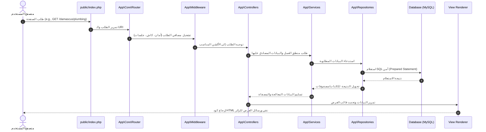
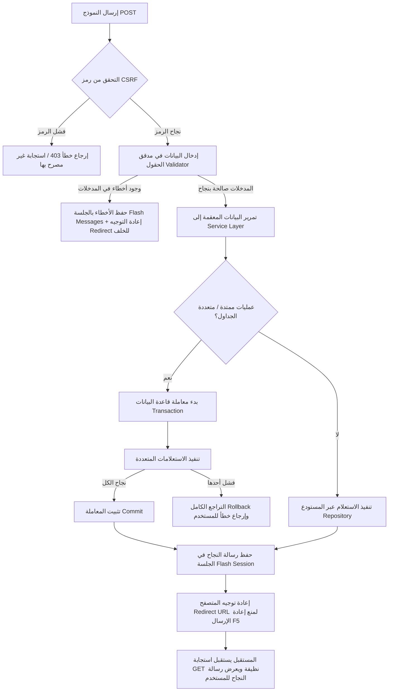

# 03. Request Lifecycle (دورة حياة الطلب)

يوثق هذا المستند رحلة الطلب البرمجي عبر منصة خدومة منذ لحظة نقر المستخدم على الرابط وحتى استلام استجابة الـ HTML أو البيانات.

---

## 1. دورة حياة طلبات القراءة (GET Request Flow)

تسير طلبات عرض الصفحات وفق التدفق الخطي التالي لضمان أمان البيانات وجودة الأداء:

---

## 2. دورة حياة طلبات الإرسال والكتابة (POST/Form Submission Flow)

عند محاولة الحرفي أو الزائر إرسال بيانات (مثل التسجيل، إضافة مراجعة، أو الدخول للوحة التحكم)، يتبع النظام آلية صارمة تضمن الأمان وتلافي تكرار الإرسال:

---

## 3. تفاصيل حماية إعادة الإرسال (POST-Redirect-GET Pattern)

لمنع إرسال البيانات المكررة إلى قاعدة البيانات عند تحديث المستخدم للمتصفح (F5)، يمنع النظام تماماً إرجاع واجهة HTML مباشرة من طلبات POST. يجب على أي متحكم يستقبل طلب POST أن ينتهي بـ:
1. معالجة البيانات بنجاح أو فشل.
2. تخزين الرسائل القصيرة (Success/Error Messages) في الجلسة `$_SESSION['flash']`.
3. إرسال رأس إعادة التوجيه `Location: /target-page` وإنهاء السكربت فوراً عبر `exit()`.
4. يستقبل المتصفح طلب GET ويعرض الرسالة ثم يحذفها من الجلسة تلقائياً.
