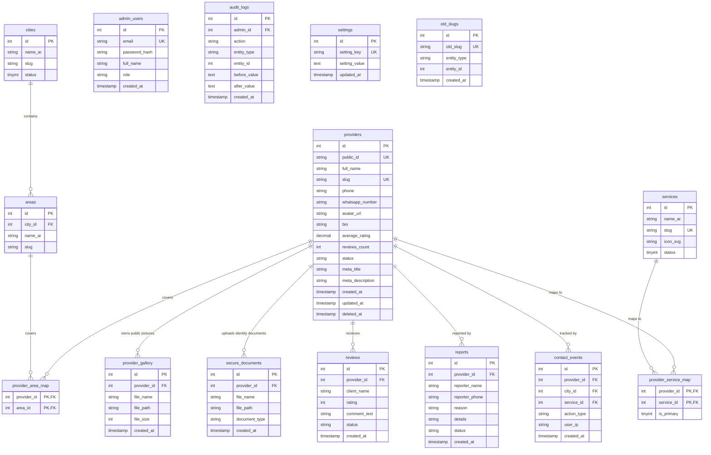

# 05. Entity-Relationship (ER) Diagram

يوضح هذا المخطط العلاقات البينية لجداول قاعدة البيانات، ومفاتيح الربط الأساسية والثنائية لضمان سلامة البيانات المرجعية.

---

## 1. مخطط الكيانات والعلاقات (Mermaid ER Diagram)

---

## 2. قواعد السلامة المرجعية (Referential Integrity Rules)

* **الربط الحاسم (Strict Cascades):** يتم مسح السجلات الوسيطة في جداول الخرائط (`provider_service_map`, `provider_area_map`) تلقائياً في حال حذف الحرفي أو الخدمة/المنطقة.
* **الحذف الناعم (Soft Delete):** الحرفيون لا يتم حذفهم فعلياً من قاعدة البيانات عند تفعيل خيار الحذف، بل يتم تعيين الحقل `deleted_at`. بالتالي، لا يتم كسر العلاقات المرجعية التاريخية في جداول الأحداث والمراجعات (`contact_events`, `reviews`).
* **فصل وثائق الأمان:** وثائق الهوية والشهادات (`secure_documents`) تنعزل تماماً في جدول خاص بها لمنع الخلط بينها وبين المعرض العام للصور ولتسهيل منح أو حجب الصلاحيات البرمجية على هذا الجدول.
