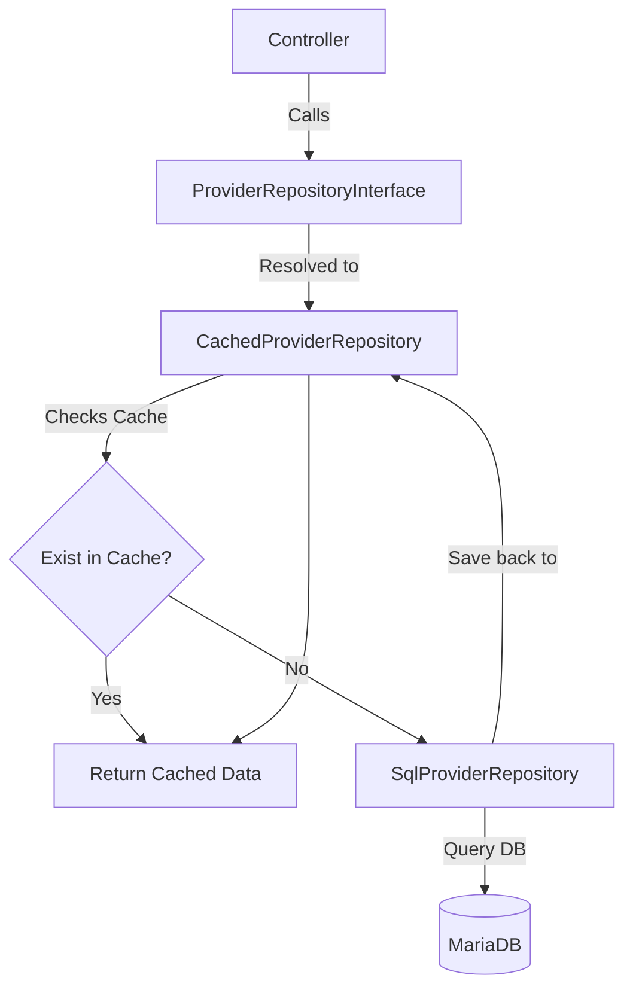

# 09. Repository Layer Design (طبقة المستودعات والوصول للبيانات)

توثق هذه الصفحة معمارية طبقة الوصول للبيانات (Data Access Layer) باستخدام نمط المستودع (Repository Pattern) لضمان عزل استعلامات قاعدة البيانات عن منطق التطبيق.

---

## 1. فلسفة المستودعات (Repository Philosophy)

تتلخص وظيفة المستودعات في تقديم واجهة برمجية شبيهة بمجموعات البيانات في الذاكرة (In-Memory Collection)، بحيث لا تحتاج بقية أجزاء النظام لمعرفة نوع قاعدة البيانات أو هيكل الجداول للوصول للمعلومات.

**الفوائد الأساسية:**
* **عزل استعلامات SQL:** تنحصر جميع جمل الاستعلامات والـ Joins المعقدة داخل ملفات المستودعات حصرياً.
* **تسهيل اختبار الأكواد (Unit Testing):** يسهل استبدال المستودعات الحقيقية بمستودعات وهمية (Mock Repositories) أثناء إجراء الاختبارات الآلية.
* **مرونة الترقية والتطوير:** في حال الرغبة بالانتقال إلى قاعدة بيانات أخرى أو دمج ذاكرة مؤقتة (Caching)، يتم ذلك دون تعديل كود الخدمات أو المتحكمات.

---

## 2. واجهات المستودعات الأساسية (Repository Interfaces)

تخضع كافة المستودعات لعقود عمل مكتوبة (Interfaces) في مجلد `/app/Repositories/Interfaces/`:

1. **`ProviderRepositoryInterface`:**
   * `findById(int $id): ?Provider`
   * `findByPublicId(string $publicId): ?Provider`
   * `findBySlug(string $slug): ?Provider`
   * `search(array $filters): array`
   * `create(array $data): int`
   * `update(int $id, array $data): bool`
   * `delete(int $id): bool`
2. **`ReviewRepositoryInterface`:**
   * `getApprovedByProviderId(int $providerId): array`
   * `getPending(): array`
   * `updateStatus(int $id, string $status): bool`
3. **`ServiceRepositoryInterface`:**
   * `getAllActive(): array`
   * `getBySlug(string $slug): ?Service`

---

## 3. خطة دمج الذاكرة المؤقتة مستقبلاً (Caching Strategy)

أحد أهم مميزات استخدام نمط المستودع هو إمكانية تفعيل الذاكرة المؤقتة (Caching) باستخدام نمط المزخرف (Decorator Pattern) دون كسر الأكواد الحالية.

**كيفية التطبيق مستقبلاً (مثال تصوري):**
1. ننشئ فئة جديدة باسم `CachedProviderRepository` تطبق نفس الواجهة `ProviderRepositoryInterface`.
2. تستقبل هذه الفئة المستودع الأصلي `SqlProviderRepository` بالإضافة إلى محرك الكاش.
3. عند طلب بيانات حرفي، تتحقق فئة الكاش من وجودها في الذاكرة؛ إن لم تجدها، تجلبها من المستودع الفعلي وتخزنها ثم تعيدها للمستخدم.

